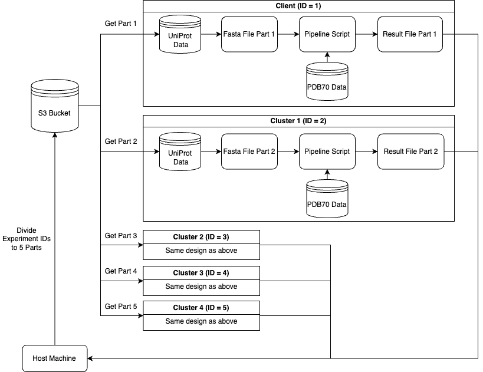

# Engineering for Data Analysis - Protein Prediction Project
> This project employs Amazon Web Services (AWS) to establish a distributed analysis system for running a 3D protein-prediction task. The primary challenge in protein prediction is the extensive time required for accurate forecasts. By leveraging a single AWS host machine to coordinate multiple worker machines, this project aims to significantly expedite the protein structure prediction process, improving the existing process's efficiency to facilitate relevant biological and pharmaceutical research better.

## AWS Infrastructure

In this project, 6 AWS machines (EC2 instances) were employed, including 1 host machine, 1 client machine and 4 cluster machines. The host machine utilised Ansible for orchestrating operations across the network, managing file distribution, task allocation, and document control, while not participating in the protein prediction task. The client machine and 4 cluster machines were the main worker machines as they were dedicated to executing ML prediction tasks under the host machine's instructions. 

## Repository File Structure
The files in the repository are organised in 4 folders as shown in the table below. 

| Folder name | Description |
|----------|----------|
| [Ansible](./Ansible/) | Contains all the YAML playbook files| 
| [Coursework](./Coursework/) | Contains Python scripts, experiment id files, Uniprot dataset and etc.| 
| [Results](./Results/) | Contains output result files and CSV files |
| [Shell](./Shell/) | Contains shell scripts to run | 

## Pipeline Design


Based on the architecture diagram, the host machine split up 6000 IDs from the experiment_ids.txt into 5 text files unequally. Since the client machine had a greater capacity, it was responsible for making 2000 predictions, while other cluster machines made 1000 predictions each. Therefore, after splitting via a Python script, the 5 ID files were uploaded to the S3 bucket. Each machine then downloads 1 ID file from the bucket and carries out the prediction tasks simultaneously. Once the prediction tasks were completed, the host machine would collect and compile the results from all the worker machines.

## Usage
### Prerequisites
The host machine needs to have Python3, Pip and Ansible installed.

```shell
sudo yum install python3 python3-pip -y
python3 -m pip install --user ansible
```

### Installation
Clone the repository.
```shell
git clone https://github.com/MC-Kangan/UCL_COMP0235_BIOCHEM_PROJECT.git
cd UCL_COMP0235_BIOCHEM_PROJECT
```

### Setup SSH keys for inter-machine connection
On the host machine, generate project_identity key and distribute the key using the below.

```shell
~/UCL_COMP0235_BIOCHEM_PROJECT/Shell/gen_key.sh 
```
The shell script ([gen_key.sh](./Shell/gen_key.sh)) does the following:
- Generate a new key in the .ssh folder
- [Distribute the keys to worker machines](./Ansible/distribute_keys.yaml)

### Setting up worker (client and cluster machines)
Run the shell script to setup the worker machines.

```shell
~/UCL_COMP0235_BIOCHEM_PROJECT/Shell/worker_setup.sh 
```
The shell script ([worker_setup.sh](./Shell/worker_setup.sh)) contains the following steps via Ansible:
- [Mount block storage](./Ansible/mount_volume.yaml)
- [Install software dependencies](./Ansible/setup.yaml)
- [Setup Node Exporter for monitoring](./Ansible/node_exporter.yaml)

### Download codebase for S4Pred and HH-suite and PDB70 dataset
```shell
~/UCL_COMP0235_BIOCHEM_PROJECT/Shell/download.sh 
```
The shell script ([download.sh](./Shell/download.sh)) contains the following steps via Ansible:
- [Download code fof S4Pred and HH-suite from Github](./Ansible/code_downloader.yaml)
- [Download PDB70 database](./Ansible/data_downloader.yaml)

### Start the ML pipeline
```shell
~/UCL_COMP0235_BIOCHEM_PROJECT/Shell/start_pipeline.sh
```
The shell script ([start_pipeline.sh](./Shell/start_pipeline.sh)) contains the following steps:
- On the host machine, [split the 6000 ids to 5 parts](./Coursework/distribute_ids.py)
- Sync local files in Coursework folder with the S3 directory
- [Download files from S3 bucket](./Ansible/s3_bucket.yaml)
- [Run the ML prediction task in the distributed fashion](./Ansible/distribute_work.yaml)

> Note: in [distribute_work.yaml](./Ansible/distribute_work.yaml), user could modify the playbook to switch between test mode and normal mode. The test mode will allow each machine to make 5 predictions. In the code snippet below for running the [pipline_script.py](./Coursework/pipeline_script.py), option T refers to testing mode. Change T to F for normal mode.
```shell
nohup python pipeline_script.py {{ host_index }} T > logfile.log 2>&1 &
```
### Monitoring
- Prometheus: http://3.10.160.39:9090/
- Grafana Dashboard: http://3.10.160.39:3000/

### Collect results and compute summary statistics
Once the Grafana dashboard shows 100% completion, run the shell script to collect results and compute statistics.
```shell
~/UCL_COMP0235_BIOCHEM_PROJECT/Shell/collect_result.sh
```
The shell script ([collect_result.sh](./Shell/collect_result.sh)) contains the following steps:
- [Collect results from worker machines](./Ansible/collect_result.yaml)
- [Compile results and compute statistics](./Coursework/compile_results.py)

The two output CSV files can be found in the [Results folder](./Results/).


## Contact
Kangan Chen - ucabkk1@ucl.ac.uk

Project Link: [https://github.com/MC-Kangan/UCL_COMP0235_BIOCHEM_PROJECT](https://github.com/MC-Kangan/UCL_COMP0235_BIOCHEM_PROJECT)
